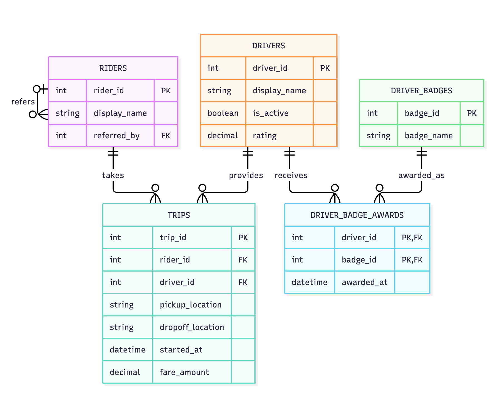

# ex603-ride-sharing-database

## Mohannad Khasawneh 
Ride Sharing Database

A relational database design for a ride-sharing platform that connects riders with drivers and records trips, fares, and driver badges.

### Theme

Ride Sharing

The database is organized around five main roles:

* Actor: Riders
* Producer: Drivers
* Event: Trips
* Catalog: Driver Badges
* Junction: Driver Badge Awards
* Metric: Fare Amount

### Domain

This project models the relational database for a ride-sharing platform that connects riders with drivers. Riders use the platform to take trips, while drivers provide transportation services. Each trip records the rider and driver involved, when the trip occurred, and the fare charged. The platform also maintains information about whether drivers are active and includes a numeric driver attribute that can be used for filtering and analysis.

The database also tracks badges that can be awarded to drivers. A driver may earn multiple badges, and the same badge may be awarded to many different drivers. The system should be able to answer questions such as which rider and driver were involved in a trip, how much a trip cost, how many trips a driver completed, how much fare revenue a driver generated, which drivers are currently active, and which badges have been awarded to each driver.

### Entity Relationship Diagram

The Entity Relationship Diagram (ERD) represents the five relations in the ride-sharing database and the relationships between them.

### Schema

## Schema

The database schema is defined in [`schema.sql`](schema.sql) and models the main data needed for the ride-sharing platform.

### Tables

- **Riders** — stores rider information and supports referrals between riders.
- **Drivers** — stores information about drivers on the platform.
- **Trips** — represents trips between riders and drivers.
- **Driver Badges** — defines badges that drivers can earn.
- **Driver Badge Awards** — records which badges have been awarded to which drivers.

### Design Decisions

The schema uses foreign keys to maintain relationships between the tables. Trips reference both a rider and a driver, while driver badge awards connect drivers and badges through a junction table.

The rider referral is modeled as a recursive relationship, where a rider can optionally reference another rider as their referrer. Driver badges use a many-to-many relationship because a driver can earn multiple badges and the same badge can be awarded to multiple drivers.

The schema also uses `CHECK` constraints to prevent invalid data from being stored and explicit `ON DELETE` actions to define what happens to related records when referenced data is removed. The reasoning behind these constraint choices is documented in [`analysis/unit2.md`](analysis/unit2.md).